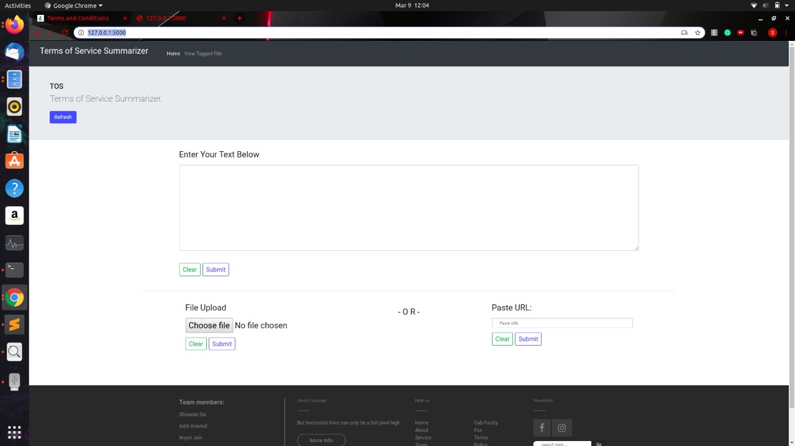
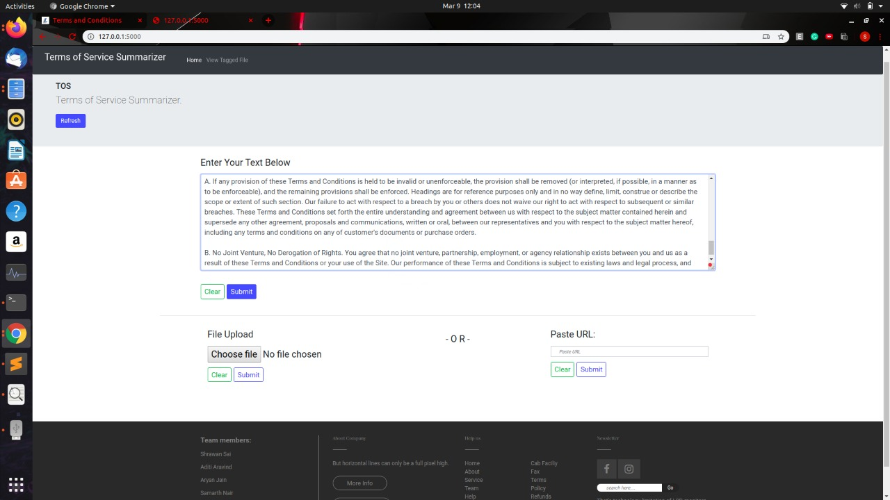
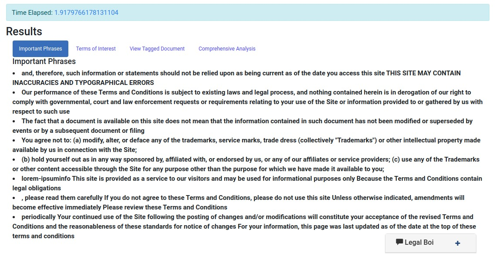
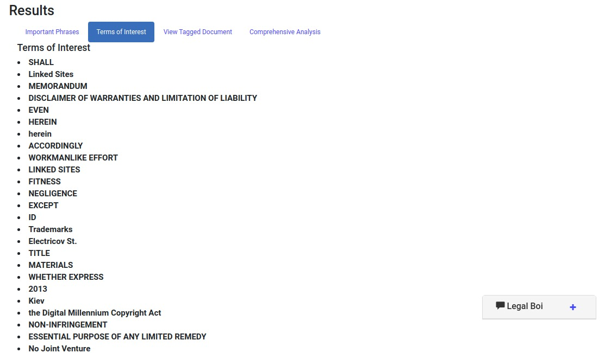
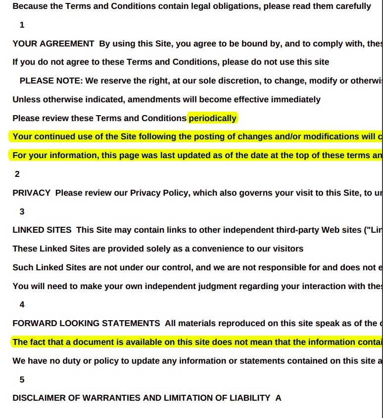
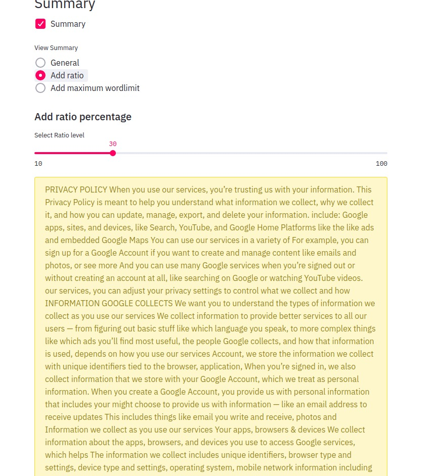
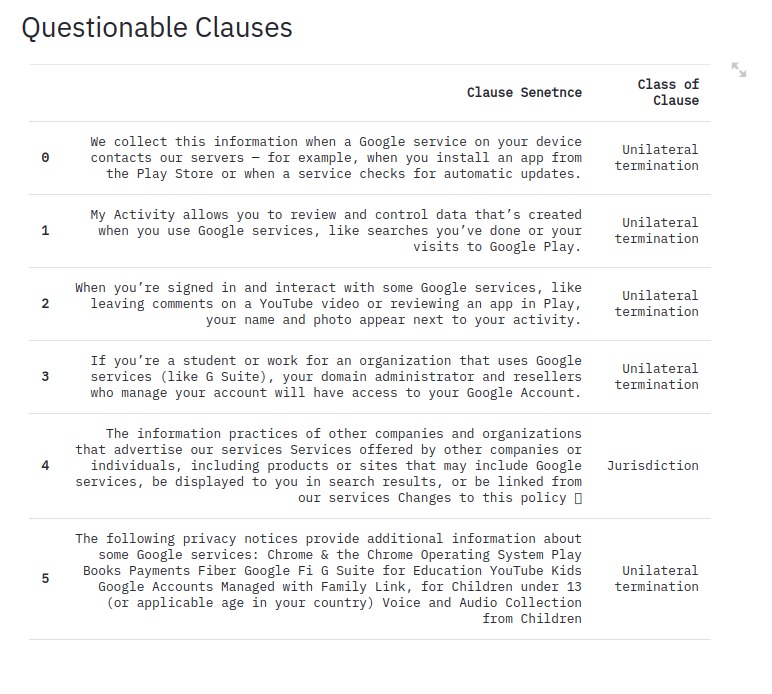

# Terms-Of-Service-Summarizer-python-
Terms of Service summarising application using flask

Hello!
Fair Warning, the code is very messy.
We will try to fix that in our next commit(probably). 
For now, here's an explanation on how to run the project(as we obviously havent followed any standards).

### Downloads
- First, you need to clone the repository to your desired location. This entire folder will be called your root or project folder.

- Now, you need to download one more thing in the root folder in the below given specific folder format.
<pre> 
  -Term-of-Service-Summarizer-python(root folder)
    |_ templates
    |_ models
      |_bert_qa_vGPU-sklearn.joblib
      |_bert_qa_vCPU-sklearn.joblib
    |conversionpackages.py
    |(other files)
 </pre>   

### Download the following: 
https://drive.google.com/open?id=1LjfirrfFyR5mWFb8QMBC9Z-HnosGCGMA
  
### You're all setup to run the project now. Follow the given steps:
- Step 1: Open terminal in your project/root directory. For those who got scared by that statement, dont worry. It's just opening the terminal and navigating to the project/root folder
- Step 2: Type the following command: "python newtest_app.py". You'll most probably encounter errors at this point of the type "______ module not found". Just pip install those modules and google any module that you dont know how to install. We'll try uploading the requirements list in the next commit.
- Step 3: If everything is correct, you should get a server running message and a hyperlink "http://127.0.0.1:5000". Open this link in any browser. You should see the first page of the application. Go ahead and check out the three options(URL under developement) to input any terms of service.
- Step 4: This step is to run the "Comprehensive analysis" part of the project. Open another terminal(donot close the previous one) and type the command "python visuals.py". You might run into errors again, keep installing the missing modules(i recommend you make a virtual env for this project)
- Step 5: Now the comprehensive analysis part should be up and running.
    
    
### Content for future commits:
- requirements.txt file - should contain module requirements
- explanation.txt file - explain all important files and general flow

# Demo of the Application:
The server opens up to this page:

You can enter text, or upload a file or provide a copy of the url of the document/agreement you want to summarize.

Once submit is clicked, you get the "Quick Results":
The important phrases of the document - 

The Terms of Interest (Most common words, dates, figures etc)

There's also an option available to get the same document with all the important phrases that were extracted earlier to be highlighted so you can save and read it later whenever you want -

Also on this page is a provision for a chatbot.
This is trained to answer questions on the basis of the document/text you have provided.
For example:

Now coming to the Comprehensive Analysis:
We provide a basic summary - 

You have the option to shorten or lengthen the summary based on the number of words or as a ratio of the entire document-

This comprehensive analysis also shows you some of the clauses that it deemed "questionable" in the agreement, along with a potential reason as to why it may be bad for you -

Finally, you also can view a wordcloud or an LDA for some visual stimulus

